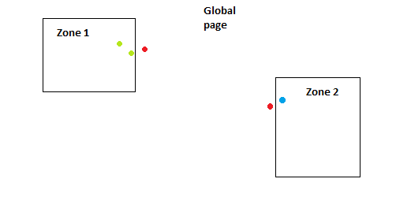

# iframe-touch-relay
Relays touch events inside iframe, to support multi-touch on pages with multiple iframes.

Sample how it works in practice. Let's say we have global page, and two designated zones. Two persons touch screen in two different places. Now `iframe-touch-relay` find which individual touch should belongs to each zone. and resend each syntetic touch to zone iframes. On the screen below, the red touches wouldbe delivered to global page, green touches would be delivered to Zone 1, and blue touches would be delivered to Zone 2.

